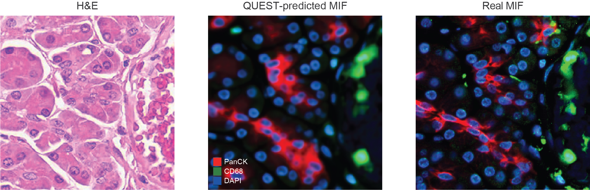

# QUEST


**QUE**ry-based virtual **ST**aining: multiplex immunofluorescence predicted from H&E, with dynamic
output panel. The model reads a frozen encoding of the H&E plus a semantic embedding of each marker name.

## Quick start

```python
import matplotlib.pyplot as plt
from quest import QuestGenerator

he = plt.imread("assets/example_he.png")[..., :3]  # (224, 224, 3)
mif = QuestGenerator("quest-semantic")([he], ["PanCK", "CD68", "DAPI"])
```



A panel predicted through a continuous 3D volume.

https://github.com/user-attachments/assets/c26a57bb-08cc-4ca1-90bc-cd2c4dbd6b46

## Tutorials

We prepared tutorials from virtual staining to downstream applications.


| Tutorial                                                         | What for                                                                        |
| ---------------------------------------------------------------- | ------------------------------------------------------------------------------- |
| 📦 [00_data](tutorials/00_data.ipynb)                               | what to download, where it goes, and the format of each cohort                  |
| 🔬 [01_predict_mif](tutorials/01_predict_mif.ipynb)                 | predict a panel from one H&E patch, and score it against the real MIF           |
| 🧫 [02_cell_typing](tutorials/02_cell_typing.ipynb)                 | cell types from a virtual stained expression                                    |
| 📐 [03_distance_entropy](tutorials/03_distance_entropy.ipynb)       | cell-cell distance and neighbourhood entropy from based on cell typing          |
| 🗺️ [04_cn_annotation](tutorials/04_cn_annotation.ipynb)             | cell states and cellular neighbourhoods discovered from H&E alone               |
| 🔎 [05_retrieval](tutorials/05_retrieval.ipynb)                     | search a stained archive with an H&E query                                      |
| 📈 [06_patient_aggregation](tutorials/06_patient_aggregation.ipynb) | patches to a patient survival prediction, and which patch contribution analyses |


Set the two constants at the top of `tutorials/_common.py`, get the data with [Tutorial 0](tutorials/00_data.ipynb), then explore them step-by-step.

## Weights


| repo                                                          |                                                                                |
| ------------------------------------------------------------- | ------------------------------------------------------------------------------ |
| [yandrewl/QUEST](https://huggingface.co/yandrewl/QUEST) | three QUEST models, cell typer, the Eva marker table |
| [yandrewl/Eva](https://huggingface.co/yandrewl/Eva)           | `Eva_model.ckpt`, the MIF foundation encoder the retrieval benchmark embeds in |
| [MahmoodLab/UNI2-h](https://huggingface.co/MahmoodLab/UNI2-h) | the frozen H&E encoder |


| model            |                                                                                   |
| ---------------- | --------------------------------------------------------------------------------- |
| `quest-semantic` | marker queries from a semantic embedding of the marker's name                     |
| `quest-id`       | the same architecture with a fixed learned per-marker table instead               |
| `quest-eva`      | a masked autoencoder that inpaints the marker channels of a partly observed stack |


Check [quest.zoo](./quest/zoo.py) for detailed description of model architectures and configurations.

## Data quick start

`huggingface-cli login` first.

```python
import shutil
from huggingface_hub import snapshot_download, hf_hub_download

snapshot_download("yandrewl/QUEST", local_dir="checkpoints",             # weights, 1.5 GB
                  allow_patterns=["*.ckpt", "*.npz"])

snapshot_download("yandrewl/QUEST-tutorial-data", repo_type="dataset",   # cohorts, 1.7 GB
                  local_dir="data",
                  allow_patterns=["crc-metu/*",      # 73 MB   tutorial 6
                                  "bog-86337/*",     # 36 MB   tutorial 4
                                  "stanford-pc/*"])  # 1.6 GB  tutorials 1, 5

shutil.copy(hf_hub_download("yandrewl/Eva", "Eva_model.ckpt"),           # tutorial 5
            "checkpoints/Eva_model.ckpt")

from questkit import cohort                                             # tutorials 2, 3
cohort.fetch_pathocell(["reg016_B", "reg032_B"])                        # ~350 MB / region
```

`QUEST_DATA` points elsewhere if you keep the cohorts outside the repo. [Tutorial 0](tutorials/00_data.ipynb) has the file formats.

## License

Code, weights and staged cohorts are released under
[CC BY-NC-ND 4.0](https://creativecommons.org/licenses/by-nc-nd/4.0/). See [`LICENSE`](./LICENSE).
